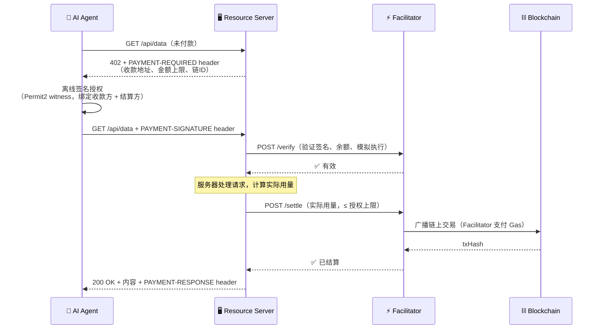

# x402 — AI Agent 的互联网原生支付协议

> HTTP 402 沉睡了 30 年。现在，任何程序都能像浏览网页一样，自动为 API、数据和计算服务付款。

<!-- ★ 把下面这行换成你录制的 Demo GIF，这是评委看到的第一张图 -->
<!--  -->

**[👉 在线 Demo]([DEMO_URL])** · **[📺 演示视频]([VIDEO_URL])** · [docs.x402.org](https://docs.x402.org)

---

## 我们在黑客松里做了什么

<!-- ★ 这是评委最先问的问题。用 2-4 句话说清楚你的贡献边界。 -->
<!-- 示例（按实际情况修改）：                                      -->
<!-- 我们在 x402 开源协议基础上，这次黑客松期间完成了三件事：       -->
<!-- 1. 实现了 `upto`（可变额度）支付方案，让 AI Agent 按实际 token -->
<!--    用量付款，而不是预先锁定固定金额                            -->
<!-- 2. 新增 Stellar 链支持（Soroban SEP-41 token 转账）           -->
<!-- 3. 搭建了端到端 Demo：一个 LangChain Agent 通过 x402 自主完成  -->
<!--    付款，链上 Tx 可查                                          -->

**[在这里用 3-4 句话描述你这次黑客松做的具体工作]**

链上交易记录（可在区块浏览器验证）：
- Tx 1：`[0x...交易哈希]` — [[查看]([EXPLORER_URL/tx/HASH])]
- Tx 2：`[0x...交易哈希]` — [[查看]([EXPLORER_URL/tx/HASH])]

---

## 问题与解法

### 问题：AI Agent 能自动做任何事，除了付款

一个 LangChain / Claude Agent 今天可以自动搜索、写代码、发邮件。但当它需要调用一个付费 API——一条天气数据、一次图像识别、一个 LLM 推理——它只能停下来等人类介入：绑定信用卡、OAuth 授权、手动点击确认。

这个断层在 AI Agent 时代是真实的瓶颈。API 开发者想收费，要接 Stripe、管账户体系，一个"按次计费"需求变成两周后端工程；Agent 想付款，没有任何协议层支持。

### 解法：把支付嵌进 HTTP 协议本身

x402 让这件事变成 3 步：

```
1. GET /api/data          →  服务器：402 + 收款指令（链、地址、金额）
2. Agent 签名授权         →  GET /api/data + PAYMENT-SIGNATURE header
3. 服务器验证 + 链上结算  →  200 OK + 数据
```

**无账户。无重定向。无人工干预。** Agent 自主完成，和 HTTP 请求一样自然。

---

## Demo

### 一个真实场景：AI Agent 按 token 用量自动付款

<!-- ★ 用文字讲一个端到端故事，哪怕只有 5 句话。评委需要"故事"而不是"功能列表" -->

**场景**：一个 AI 写作助手调用我们的文本生成 API。它不知道自己会用多少 token，
于是用 `upto`（可变额度）方案：预先签授权"最多付 $0.10"，服务器处理完后，
按实际消耗的 token 数结算，多余的钱分文不动——全程没有人类介入。

```
Agent  →  POST /api/generate         (未付款)
Server ←  402  {scheme:"upto", price:"$0.10", network:"eip155:84532"}
Agent  →  POST /api/generate         (PAYMENT-SIGNATURE: 签名授权最多 $0.10)
           ...服务器生成内容，计算实际用了 437 tokens = $0.004...
Server →  Facilitator: settle($0.004)   ← 只收实际用量，不是上限
Chain  ✓  Tx: [0x...实际交易哈希]
Agent  ←  200  {result: "...", charged: "$0.004"}
```

### 卖家：开启 API 收费

```typescript
import { paymentMiddleware } from "@x402/express";
import { UptoEvmScheme } from "@x402/evm/upto/server";

app.use(paymentMiddleware({
  "POST /api/generate": {
    accepts: [{
      scheme: "upto",
      price: "$0.10",          // Agent 授权上限
      network: "eip155:84532", // Base Sepolia
      payTo: "0xYourAddress",
    }],
    description: "AI 文本生成，按 token 实际用量结算",
  },
}, resourceServer));

// 在路由处理器里，按实际用量覆盖结算金额
app.post("/api/generate", async (req, res) => {
  const result = await generateText(req.body.prompt);
  const actualCost = result.tokens * TOKEN_PRICE;
  setSettlementOverrides(res, { amount: `$${actualCost}` }); // 只收实际用量
  res.json({ result: result.text, charged: `$${actualCost}` });
});
```

### 买家（AI Agent）：自动处理付款

```typescript
import { wrapFetchWithPayment } from "@x402/fetch";
import { UptoEvmScheme } from "@x402/evm/upto/client";

// 注册支付能力，包装 fetch
const client = new x402Client().register("eip155:*", new UptoEvmScheme(signer));
const fetchWithPayment = wrapFetchWithPayment(fetch, client);

// Agent 正常调用，SDK 自动处理 402 → 签名 → 重试
const res = await fetchWithPayment("https://api.example.com/api/generate", {
  method: "POST",
  body: JSON.stringify({ prompt: "写一首关于区块链的诗" }),
});
// Agent 收到内容，钱已经在链上结算完毕
```

### 截图

<!-- ★ 强烈建议补充以下截图/GIF，完成度评分很大程度取决于此 -->

| 场景 | 截图 |
|------|------|
| Agent 收到 402 → 自动签名 → 200 OK 全流程 | `[补充 GIF 或截图]` |
| 链上 Tx 在 BaseScan 的确认页面 | `[补充截图]` |
| `upto` 实际扣款 < 授权上限的对比 | `[补充截图]` |

---

## 它是怎么工作的



### 为什么 Facilitator 有 Gas 但无法偷钱

这是 x402 最关键的安全设计：

| | Facilitator 能做 | Facilitator 不能做 |
|--|--|--|
| **exact 模式**（EIP-3009） | 广播 `transferWithAuthorization` 交易 | 修改收款方地址或金额 |
| **upto 模式**（Permit2 witness） | 结算任意金额（≤ 授权上限） | 超过上限，或由其他方结算 |

签名里绑定了 `to`（收款方）和 `facilitator`（唯一有权结算的地址），密码学保证，合约层强制执行。

---

## Tech Stack

| 分类 | 内容 |
|------|------|
| **语言 / 框架** | TypeScript（主）· Go · Python · Java |
| **服务端集成** | Express · Hono · Next.js · Fastify · FastAPI · Flask · Gin |
| **支付链** | EVM（任意链）· Solana · Stellar · Aptos · Algorand |
| **EVM 支付方案** | `exact`/EIP-3009 · `exact`/Permit2 · `upto`/Permit2 |
| **AI 工具集成** | MCP Transport（Claude/GPT 工具生态）· A2A |
| **默认代币** | USDC（Base · Polygon · Arbitrum）· USDT · 其他 ERC-20 |
| **合约部署** | CREATE2 跨链同地址 · Base · Arbitrum · Polygon · Solana · Stellar |
| **协议许可** | Apache-2.0，零协议费 |

---

## Why Now & Why Us

**为什么是现在：** AI Agent 正在成为 API 的主要消费者，但全球没有一套支付基础设施是为"程序自主付款"设计的。Stripe 假设付款方是人类。这个断层在 2025 年之后变成了真实的产品瓶颈，不是未来问题，是今天的问题。

**为什么不是竞品：**

| | x402 | L402 / LSAT | Stripe Meter |
|--|--|--|--|
| 协议层 | HTTP 原生（402 状态码） | HTTP + Lightning 特定 | 应用层 API |
| 网络依赖 | EVM / Solana / Stellar / Aptos | Lightning Network | 法币 |
| Gas 负担 | Facilitator 代付，客户端零 Gas | 无需 Gas | 无需 Gas |
| 可变额度 | ✅ `upto` 方案 | ❌ | ✅ |
| Agent 友好 | ✅ 标准 HTTP header | 需要 Lightning 节点 | 需要账户 |
| 开源 | ✅ Apache-2.0 | ✅ | ❌ |

**为什么是 x402：** HTTP 402 是 1991 年写入 RFC 的保留状态码，从未被实现。我们把这个空槽填上，这意味着**所有现有 HTTP 基础设施零改造兼容**——不是新协议，是填上了 30 年的空缺。

---

## Roadmap

- [x] v2 协议规范 — 三头 header 标准化，CAIP-2 多链统一寻址
- [x] `upto` 可变额度方案 — 按实际用量结算，Permit2 witness 防篡改
- [x] MCP Transport — AI Agent 工具调用原生支持
- [x] Stellar 链支持 — Soroban SEP-41 token 完整实现
- [ ] Bazaar 发现协议 — 付费 API / MCP 工具的去中心化目录，Agent 自主发现可付费服务
- [ ] ERC-7710 智能账户委托 — 无私钥 Agent 的全自动支付能力

---

## Links

| | |
|--|--|
| 🌐 主站 | [x402.org](https://x402.org) |
| 📖 文档 | [docs.x402.org](https://docs.x402.org) |
| 💻 GitHub | [github.com/x402-foundation/x402](https://github.com/x402-foundation/x402) |
| 📋 协议规范 | [specs/x402-specification-v2.md](./specs/x402-specification-v2.md) |
| 🏗️ 示例代码 | [examples/](./examples/) |
| 💬 Discord | [discord.gg/cdp](https://discord.gg/invite/cdp) |

---

<sub>Apache-2.0 · x402 Foundation · 协议是公共品，实现是竞争优势</sub>
