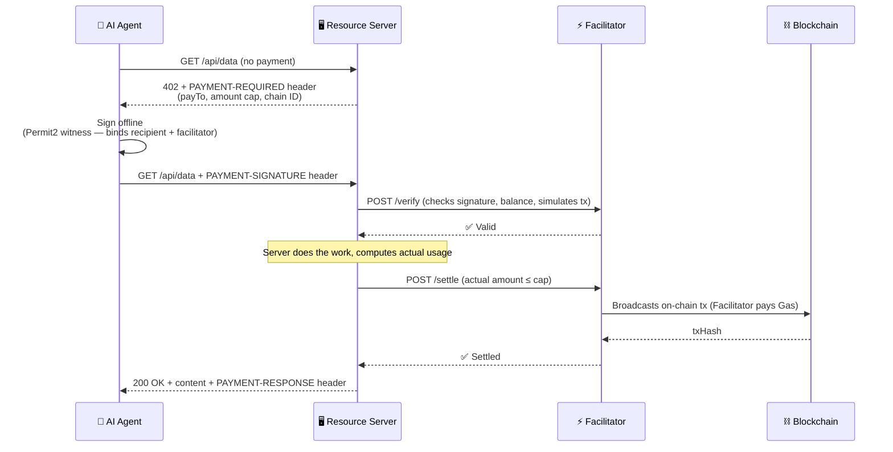

# x402 — Native HTTP Payments for AI Agents and APIs

> HTTP status 402 has been reserved since 1991. We finally made it work.

<!-- ★ Replace this line with your Demo GIF — it's the first thing judges see -->
<!--  -->

**[👉 Live Demo]([DEMO_URL])** · **[📺 Video Walkthrough]([VIDEO_URL])** · [docs.x402.org](https://docs.x402.org)

---

## Project at a Glance

**x402 lets any program pay for APIs automatically — the same way a browser loads a webpage, no accounts required.**
5 blockchains. 3 SDK languages. 1 HTTP header.

---

## What We Built This Hackathon

<!-- ★ This is the first thing judges ask. 2–4 sentences. Be specific about YOUR contribution. -->
<!-- Example (edit to match reality):                                                         -->
<!--   Built on the x402 open protocol, we shipped three things this weekend:                -->
<!--   1. The `upto` variable-amount payment scheme — agents authorize a spending cap,        -->
<!--      servers settle only what was actually used (think: pay-per-token for LLMs)          -->
<!--   2. Full Stellar chain support via Soroban SEP-41 token transfers                      -->
<!--   3. An end-to-end demo: a LangChain agent autonomously pays for API calls on-chain     -->

**[Describe your specific hackathon contribution in 3–4 sentences here]**

On-chain transactions (verifiable in block explorer):
- Tx 1: `[0x…hash]` — [[view]([EXPLORER_URL/tx/HASH])]
- Tx 2: `[0x…hash]` — [[view]([EXPLORER_URL/tx/HASH])]

---

## The Problem

AI agents can search the web, write code, and send emails autonomously. But the moment one needs to call a paid API — weather data, image recognition, an LLM inference — it stops cold and waits for a human to intervene.

The human has to: bind a credit card, complete OAuth, click confirm.

That's not an edge case. That's every monetized API on the internet today.

On the other side: API developers who want to charge per-request have to build an entire billing stack — Stripe integration, subscription management, account systems. A two-line feature becomes two weeks of backend engineering.

**The payment layer was never designed for machines. We're fixing that at the protocol level.**

---

## The Solution

x402 embeds payment directly into HTTP. 3 steps, no new infrastructure:

```
1. Agent calls  GET /api/data          →  Server: 402 + payment instructions
                                           (chain, address, amount — in a header)
2. Agent signs  PAYMENT-SIGNATURE      →  GET /api/data  (retried with signature)
3. Server verifies + settles on-chain  →  200 OK + data
```

No accounts. No redirects. No human in the loop. The agent handles it the same way it handles any other HTTP request.

---

## Demo

### Real Scenario: An AI Agent Pays Per Token Used

An AI writing assistant calls our text generation API. It doesn't know upfront how many tokens it'll use, so it uses the `upto` scheme: signs a cap of $0.10, and the server settles only for actual usage.

```
Agent  →  POST /api/generate          (no payment)
Server ←  402  { scheme: "upto", price: "$0.10", network: "eip155:84532" }

Agent  →  POST /api/generate          (PAYMENT-SIGNATURE: authorized up to $0.10)
           …server generates content, counts 437 tokens = $0.004…
Server →  Facilitator: settle($0.004)   ← actual usage only, not the cap
Chain  ✓  Tx: [0x…actual tx hash]
Agent  ←  200  { result: "…", charged: "$0.004" }
```

The agent authorized $0.10. It got charged $0.004. The difference never moved.

### Seller: Gate an API in 5 Lines

```typescript
import { paymentMiddleware, setSettlementOverrides } from "@x402/express";
import { UptoEvmScheme } from "@x402/evm/upto/server";

app.use(paymentMiddleware({
  "POST /api/generate": {
    accepts: [{
      scheme: "upto",
      price: "$0.10",           // agent's spending cap
      network: "eip155:84532",  // Base Sepolia
      payTo: "0xYourAddress",
    }],
    description: "AI text generation — billed by actual token usage",
  },
}, resourceServer));

// Inside your route handler: settle the actual cost, not the cap
app.post("/api/generate", async (req, res) => {
  const result = await generateText(req.body.prompt);
  const actualCost = result.tokens * TOKEN_PRICE;
  setSettlementOverrides(res, { amount: `$${actualCost}` });
  res.json({ result: result.text, charged: `$${actualCost}` });
});
```

### Buyer (AI Agent): Zero Changes to Existing Logic

```typescript
import { wrapFetchWithPayment } from "@x402/fetch";
import { UptoEvmScheme } from "@x402/evm/upto/client";

// Register payment capability, wrap fetch
const client = new x402Client().register("eip155:*", new UptoEvmScheme(signer));
const fetchWithPayment = wrapFetchWithPayment(fetch, client);

// Agent calls the API normally — SDK handles 402 → sign → retry
const res = await fetchWithPayment("https://api.example.com/api/generate", {
  method: "POST",
  body: JSON.stringify({ prompt: "Write a haiku about blockchains" }),
});
// Content received. Payment settled on-chain. No human touched it.
```

### Screenshots

<!-- ★ These matter for the Completion & Demo rubric. Even a terminal recording counts. -->

| Scene | Screenshot |
|-------|------------|
| Agent receives 402 → signs → 200 OK (full flow) | `[add GIF or screenshot]` |
| On-chain Tx confirmed on BaseScan | `[add screenshot]` |
| `upto`: actual charge ($0.004) vs. authorized cap ($0.10) | `[add screenshot]` |

---

## How It Works



### Why the Facilitator Can Pay Gas but Can't Steal Funds

The Facilitator broadcasts transactions and pays gas — but it's cryptographically locked out of redirecting money.

| | Facilitator CAN | Facilitator CANNOT |
|--|--|--|
| **exact** (EIP-3009) | Broadcast `transferWithAuthorization` | Change recipient or amount |
| **upto** (Permit2 witness) | Settle any amount ≤ cap | Exceed cap, or let another party settle |

The signature binds `to` (recipient) and `facilitator` (the only address allowed to call `settle()`). Enforced at the contract level — not just convention.

---

## Tech Stack

| | |
|--|--|
| **Languages** | TypeScript (primary) · Go · Python · Java |
| **Server frameworks** | Express · Hono · Next.js · Fastify · FastAPI · Flask · Gin |
| **Chains** | Any EVM chain · Solana · Stellar · Aptos · Algorand |
| **Payment schemes** | `exact` (EIP-3009 / Permit2) · `upto` (Permit2 + variable settlement) |
| **AI integrations** | MCP Transport (Claude / GPT tool ecosystem) · A2A |
| **Default tokens** | USDC on Base, Polygon, Arbitrum · USDT · any ERC-20 |
| **Contracts** | CREATE2 — same address across all EVM chains |
| **License** | Apache-2.0 · zero protocol fees |

---

## Why Now — Why Not a Competitor

Every existing solution assumes the payer is human.

| | x402 | L402 / LSAT | Stripe Metered Billing |
|--|--|--|--|
| **Protocol layer** | HTTP-native (status 402) | HTTP + Lightning-specific | Application-layer API |
| **Network dependency** | EVM / Solana / Stellar / Aptos | Lightning Network only | Fiat rails |
| **Gas burden on client** | Zero — Facilitator pays | N/A | N/A |
| **Variable amounts** | ✅ `upto` scheme | ❌ | ✅ |
| **Agent-friendly** | ✅ Standard HTTP headers | Requires Lightning node | Requires account |
| **Open source** | ✅ Apache-2.0 | ✅ | ❌ |

**Why 402 specifically:** HTTP 402 has been reserved in the RFC since 1991 — it was always meant for payments, just never implemented. We didn't invent a new protocol. We filled a 30-year gap. That means every existing HTTP client and server is already compatible — zero migration cost.

---

## Roadmap

- [x] v2 protocol spec — 3-header standard (`PAYMENT-REQUIRED` / `PAYMENT-SIGNATURE` / `PAYMENT-RESPONSE`), CAIP-2 multi-chain addressing
- [x] `upto` variable-amount scheme — per-usage settlement with Permit2 witness anti-tamper
- [x] MCP Transport — native AI agent tool-call payments (Claude, GPT ecosystems)
- [x] Stellar chain support — full Soroban SEP-41 token implementation
- [ ] Bazaar discovery protocol — decentralized directory of paid APIs and MCP tools; agents find and pay for services autonomously
- [ ] ERC-7710 smart account delegation — keyless agents pay without a private key

---

## Links

| | |
|--|--|
| 🌐 Homepage | [x402.org](https://x402.org) |
| 📖 Docs | [docs.x402.org](https://docs.x402.org) |
| 💻 GitHub | [github.com/x402-foundation/x402](https://github.com/x402-foundation/x402) |
| 📋 Protocol spec | [specs/x402-specification-v2.md](./specs/x402-specification-v2.md) |
| 🏗️ Examples | [examples/](./examples/) |
| 💬 Discord | [discord.gg/cdp](https://discord.gg/invite/cdp) |

---

<sub>Apache-2.0 · x402 Foundation · The protocol is a public good. The implementation is the advantage.</sub>
